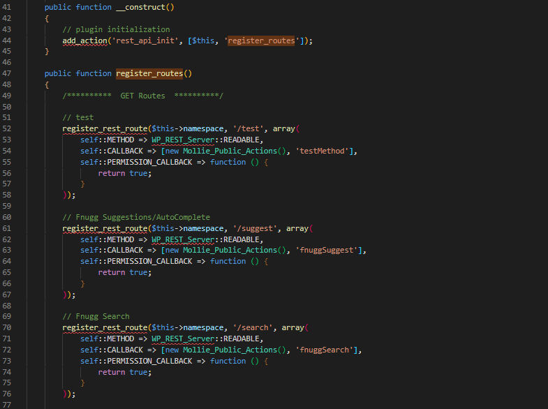
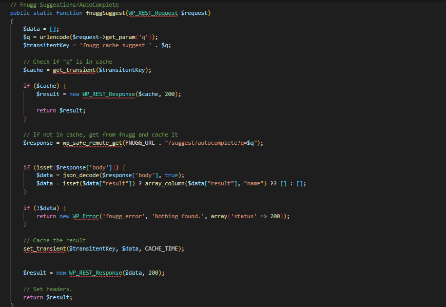
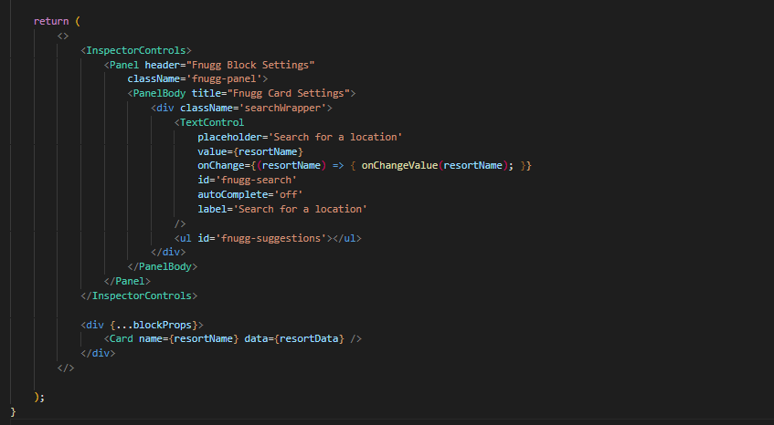
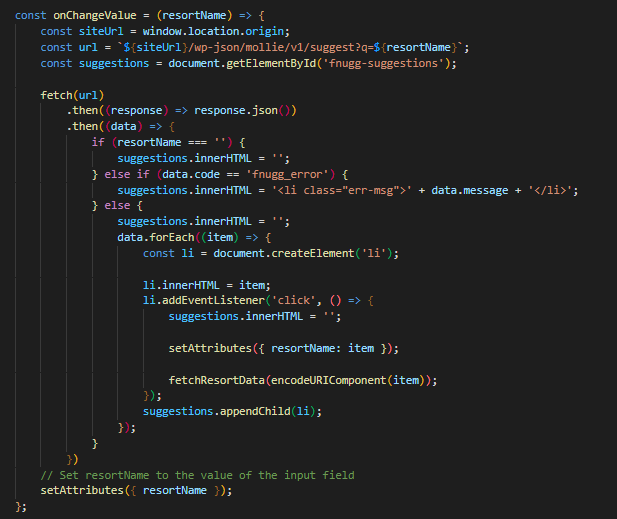

# Fnugg.no Wp Block

Upload the plugins to the plugin directory. Or use the wp installer in the dashboard.

### General Use

Add the Fnugg block in the editor.


Search for a resort in the sidebar settings.


Click the one you want and.. Voilà Magic.

## API Reference

#### Autocomplete

```http
  GET /wp-json/mollie/v1/suggest
```

| Parameter | Type     | Description                 |
| :-------- | :------- | :-------------------------- |
| `q`       | `string` | Resort Name. Or part of it. |

#### Get item

```http
  GET /wp-json/mollie/v1/search
```

| Parameter | Type     | Description |
| :-------- | :------- | :---------- |
| `q`       | `string` | Resort name |

## Run Locally

Using node version: 16.16.0

If you have trouble installing use Node Version Manage (NVM).

Clone the project

```bash
  git clone https://github.com/hnikoloski/fnugg-block
```

Go to the project directory

```bash
  cd fnugg-block
```

Install dependencies

```bash
  npm install
```

Development

```bash
  npm run start
```

Build

```bash
  npm run build
```

Create Zip

```bash
  npm run zip
```

## Code Reference

#### Registering the rest routes.

Location: `includes/api/class-mollie-api-routes.php`



#### Callback for the rest route.

Location: `includes/api/controllers/class-mollie-public-actions.php`

We get the parameter from the request and add it to the transient key, so we can cache the results.
We check if the transient exists, if it does we return it. If not we make a request to the fnugg api.
When we do the request we get only the name since that is what we need for the autocomplete.
If there are errors we return them with 'fnugg_error' so we can further handle them.
If the request is successful we set the transient and return the results.



### Block Code

We use wpscripts to build the block.

`src/block.json` contains our block settings and attributes.
The **resortName** attribute we use for the autocomplete.
The **resortData** attribute we use for for the data we get from the api.

#### edit.js



This is where we build the main block.

```jsx
<InspectorControls>
<Panel>
```

are used for the sidebar settings.

```jsx
<Card />
```

`src/components/card.js` - The Card component is our main component. It is used in the editor and the frontend.



We get the data from the props and use it to display the data.
If the data is invalid or empty we show a message.
We pass the data in variables so we can manipulate it further if we need to.
For the condition icons we get a nubmer from the api (1-9) and we use that to get the correct class name for the icon so we can use google fonts to display the icons.

## Demo

https://mollie.hnikoloski.com/
