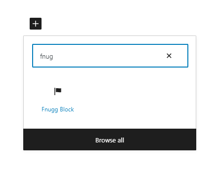
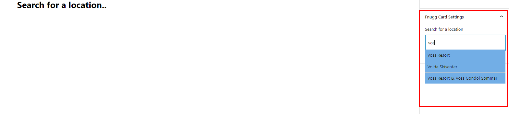

# Fnugg.no Wp Block

Upload the plugins to the plugin directory. Or use the wp installer in the dashboard.

### General Use

Add the Fnugg block in the editor.



Search for a resort in the sidebar settings.



Click the one you want and.. Voilà Magic.

## API Reference

#### Autocomplete

```http
  GET /wp-json/mollie/v1/suggest
```

| Parameter | Type     | Description                 |
| :-------- | :------- | :-------------------------- |
| `q`       | `string` | Resort Name. Or part of it. |

#### Get item

```http
  GET /wp-json/mollie/v1/search
```

| Parameter | Type     | Description |
| :-------- | :------- | :---------- |
| `q`       | `string` | Resort name |

## Run Locally

Using node version: 16.16.0

If you have trouble installing use Node Version Manage (NVM).

Clone the project

```bash
  git clone https://github.com/hnikoloski/fnugg-block
```

Go to the project directory

```bash
  cd fnugg-block
```

Install dependencies

```bash
  npm install
```

Development

```bash
  npm run start
```

Build

```bash
  npm run build
```

Create Zip

```bash
  npm run zip
```

## Demo

https://mollie.hnikoloski.com/
